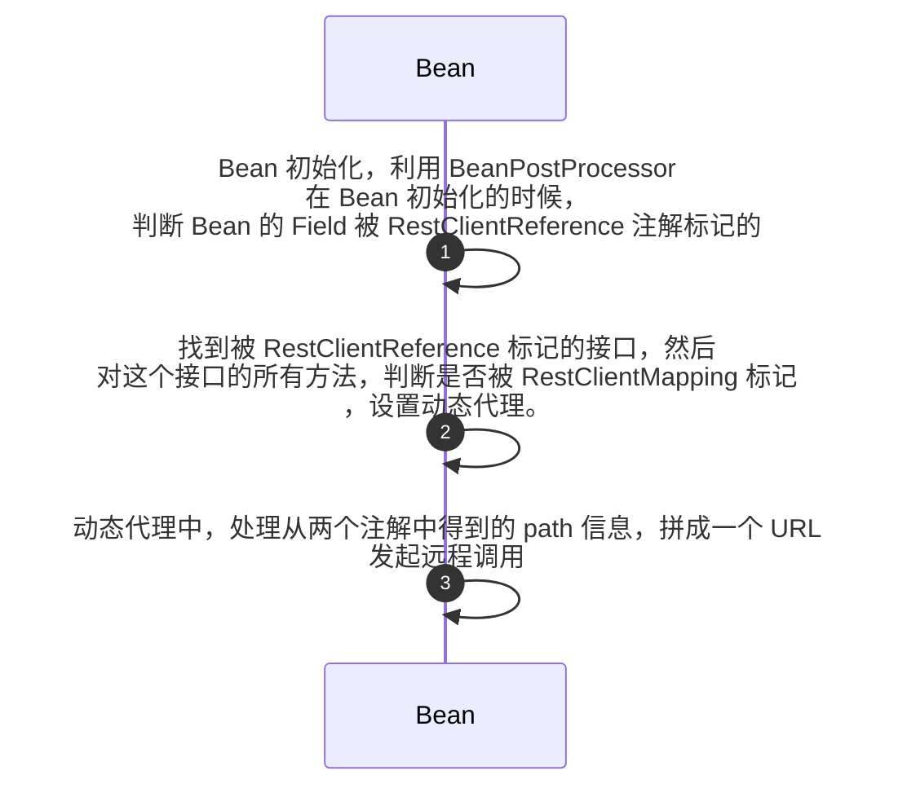
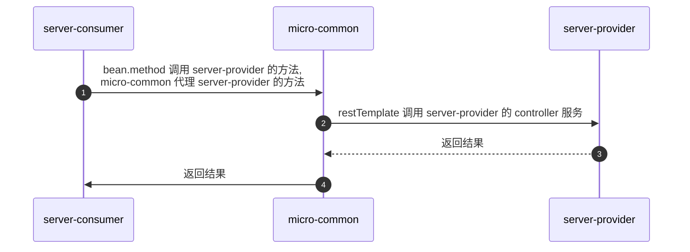

我们引入了两个注解 `RestClientMapping` 和 `RestClientReference`, 这两个注解的周期如下：

从上面的情况，我们就可以看到，假设服务 server-provider 是接口提供方，那么服务 server-consumer 调用方需要引入 server-provider 的 `API`。然后 server-provider 需要在 `API`  中指定 `RestClientMapping` 。
`RestClientMapping` 中应该写上自己提供的服务的 URL。(也就是说需要提供一个 Controller 出来)。

服务 server-consumer 需要在 `API` 中引入 server-provider 的接口，并且在这个接口上标记 `RestClientReference` 注解。这样就可以完成远程调用了。

server-provider 和 server-consumer 的调用示例图如下:

服务 server-provider 和 服务 server-consumer 的文件结构:

- **server-provider**:
    - `server-provider-controller`
    - `server-provider-service`
    - `server-provider-api`

- **server-consumer**:
    - `server-consumer-controller`
    

